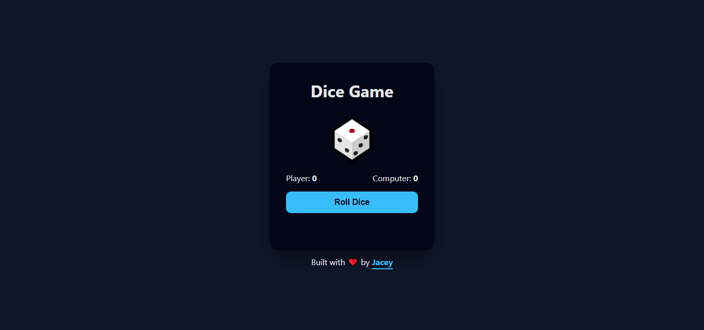

# 🎲 Dice Game



A simple, interactive dice game built to practice **JavaScript fundamentals** like DOM manipulation, event handling, and dynamic UI updates.

---

## 🚀 Features

* Roll dice and see results instantly.
* Displays the winner or a tie after each round.
* **Replay button** to start a new game without refreshing.
* Responsive design that works on desktop and mobile.
* Smooth animations for a fun experience.

---

## 🎮 How to Play

1. Click **Roll Dice** 🎲.
2. Dice values are updated and the winner is displayed.
3. Click **Replay** 🔄 to reset the game and play again.


---

## 🛠 Technologies Used

* **HTML** – page structure
* **CSS** – styling and animations
* **JavaScript** – game logic and interactivity

---

## 📂 Folder Structure

```
/dice-game
  ├─ index.html
  ├─ style.css
  └─ script.js
  └─ images/  
```

---

## ✨ Customization

* Change colors, fonts, or layout via CSS.
* Extend JS for scoring, sound effects, or other features.
